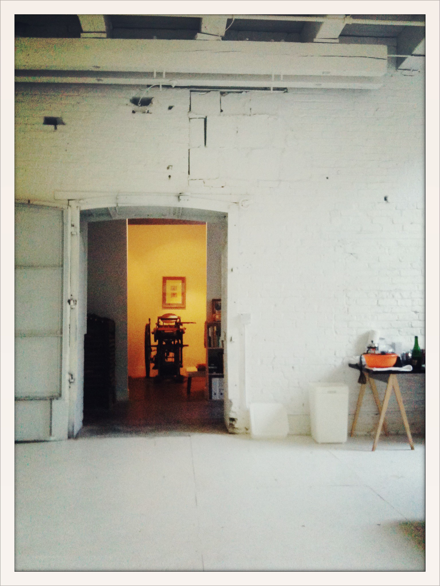
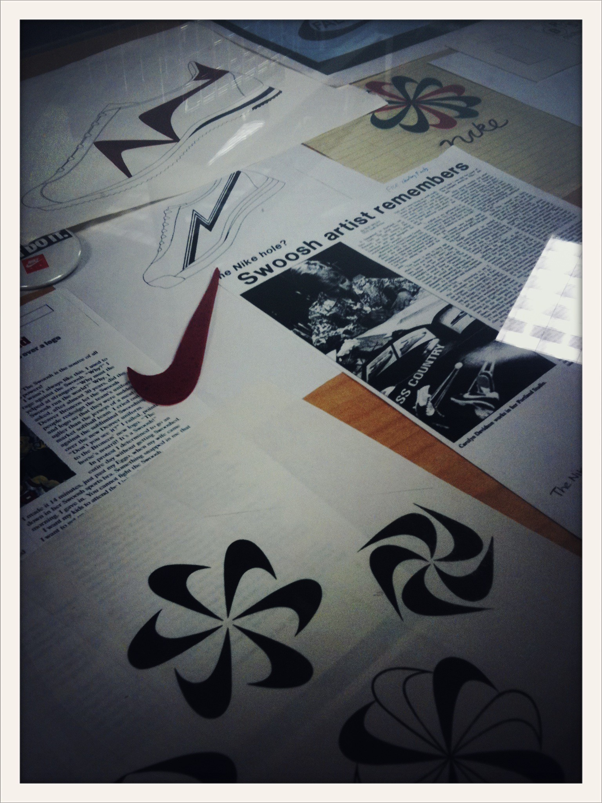
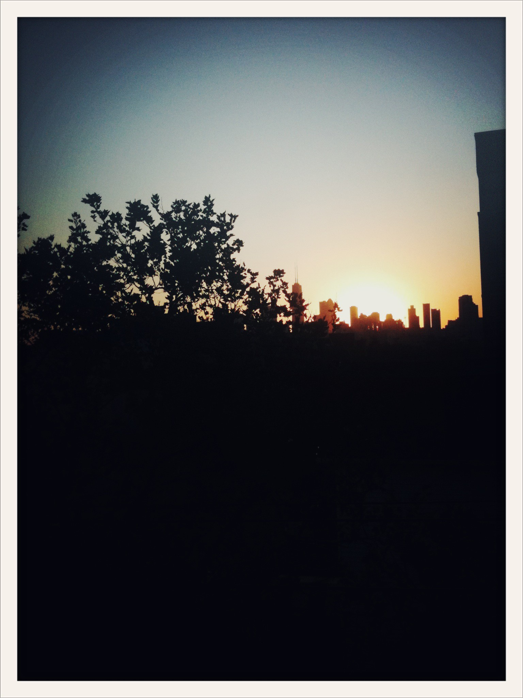
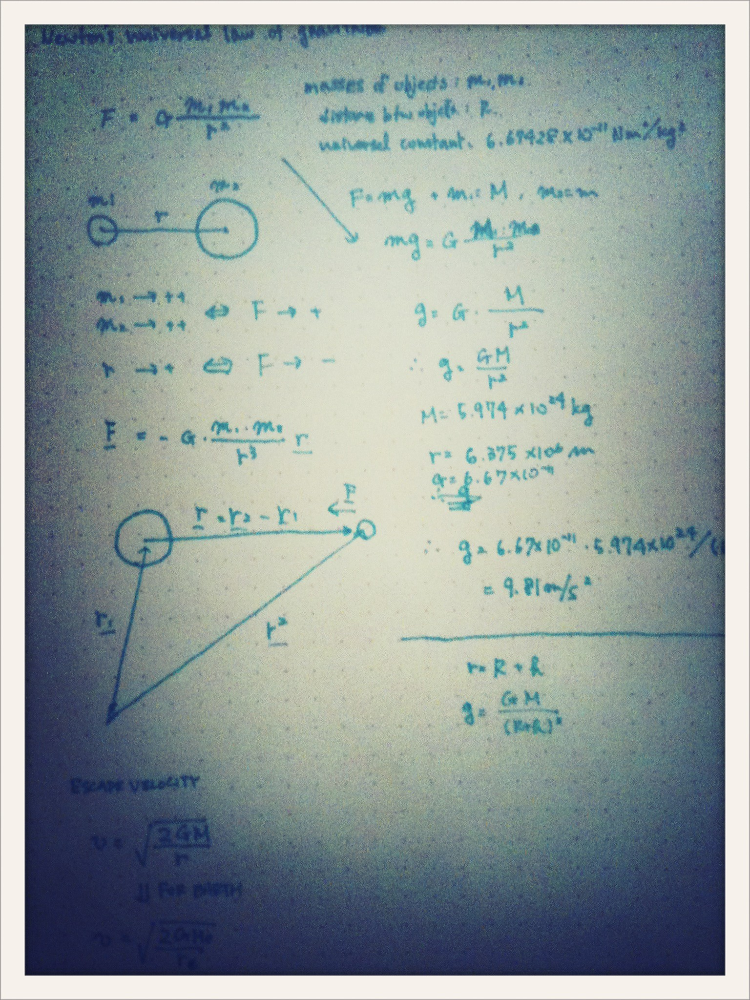

title: Next Step
date: 2012-04-20 12:00
template: article.jade

2012年3月で、1年半ほどお世話になったシカゴから離れて、今度は西海岸の方にお引っ越しすることにしました。(ビザがきちんとおりればですが…)

おそらくインターンとしてシカゴに行くと言いだしたのも丁度このころだったと思います。あの頃はWebのことなんてほとんど何にも知らなかったのによくもまぁそんなあほみたいな僕を雇ってくれました。[Scott](http://simplescott.com)には本当に感謝しています。

この時期はいろんな人が移動する時期なので、こんな記事はたくさんありますが、ここで自身の少し1年半を振り返ってみたいと思います。半分はどうしても技術的なお話ですが…

### 僕がいたチーム

さて、僕は[Simple.Honest.Work]という[SimpleScott]をはじめとするWeb中心のデザインファームで1年半お世話になりました。僕が始めたときのチームはScott, [Jeremy], [Elisabeth], そして僕、の4人の小規模チームでした。ざっくりとした役割は、ScottとJeremyがデザイン+`HTML`+`CSS`、僕はそれに加えて`JavaScript`とバックエンドとサーバ管理を担当していて、 Elisabethがクライアントとのコミュニケーションとスタジオのマネジメントを担当していました。

サーバってなんなん？(サーバ：インターネットのどこかに置いてあるパソコンみたいなもの)って状況だった僕でも、する人が居ないんだからするしかない。。。あの黒い画面(`Terminal`)は、へんなこと打ったらパソコンを壊してしまいそうでこわかったです。
デザインも忙しいScottからもらえるMockupはスケッチ程度のペンの殴り書きみたいなものなので、それからマークアップしてスタイルを当てるのは僕とかJeremyの役割でした。

小さいチームは大変ですが、その分一人一人にまかされる役目はものすごく幅が広くいろんなことをまかされるので非常にいい環境でたくさんのことを学べました。

### ついたらすぐにお勉強

シカゴについてすぐは本当に勉強のしっぱなしでした。
別にコンピュータサイエンスの大学を出た訳でもない僕にとって、`Git`ってなに？なんなん`PublicKey`って… みたいなそんな状況。サイトの更新も`FTP`みたいなレベルでした。

まず最初に始めたのは、触ったことも無い言語:`Python`の勉強でした。というかこのStudio(ちなみに、仕事場のことをみんなスタジオっていいます)でこの言語を使ったことある人は一人もいませんでした。ただ、ボスから`Ruby`か`Python`でやるでーってときになぜか最終的にこちらになったんです。

というのもその3ヶ月後にはそれを使って[The Noun Project]と[Mies van der Rohe Society]を作らなくてはならなかったため、毎日毎日勉強でした。

**The Noun Project**は世界の様々な標識などのアイコンを集める図書館のようなプロジェクトで、多くのアイコンがパブリックドメインもしくはCreative Commons Attributionで配布されています。このサイトの特別な要素としては、これらのアイコンは`png`や`jpg`などではなく、`svg`と呼ばれるファイルフォーマットをHTML内に使用している点です。「`svg`ってなんなん？」って聞かれることもありますが、要は拡大したときに*ゲジゲジにならない*(ベクター形式)とおもってもらえればいいと思います。イラレでも使えるし、ちょこっといじれば`Keynote`でも使うことができる便利なやつです。

**Mies van der Rohe Society**も同様に多くの時間とエネルギーがかかって作られています。クライアントから話を頂いたときは、基本的なIIT(Illinois Institute of Technology)の一団体のウェブページっという目的だったのですが、ミースの功績や歴史を考えてみても、それだけでは寂しいなぁってことで、「ミースの業績のアーカイブ」としてのサイト構築に切り替えました。

ミースの業績とその作品を見ていただくためにこのサイトのメインは高解像度の写真となっています。ここでも、ユーザに長い時間写真を見るために待ってもらわないために、バックグラウンドで画像を読み込んだり、画像は`nginx`と呼ばれる静的なファイルをうまく処理してくれるサーバを使用したり、目に見えない工夫もいくつか施しました。

### 政府系のプロジェクト

それらが一段落すると、次は政府系のサイトの制作に携わりました。

政府系はやはり特殊。サーバ周りのことはセキュリティの観点から全く触ることが出来なかったため、管理する会社と何度もコミュニケーションをとりながら進めていったのですが、やはり政府系。こちらからいろんな提案をしても、クライアント側は「上の人からの判断を待ってから」とものすごく時間がかかってしまう。

さらにその納期は1ヶ月と訳の分からないスケジュール。さらにさらに、僕もその頃は大学4年であったこと、さらに実は単位を全部とりきっていないまま、調子に乗ってシカゴに来てしまっていたので、期末テストを受けに日本に帰らなくてはいけませんでした。そのため、なんとしてもそれまでに仕上げなければならず、本当にばたばたした1ヶ月でした。

日本のある政府のサイトも批判を受けていましたが、あんなものは妥当です。大変です。

でもなんとか乗り切りました!もちろんちゃんと卒業できましたが、怖いのであんまり(というか全く)お勧めできないです。

### 飛行機で行ったり来たり

これが終わる頃には[Tony], [Brittany]の2人のデザイナーも加わり、スタジオも少し大きくなり始めました。

この政府のお仕事がおわったぐらいから、Nikeのプロジェクトが始まりました。最初はシカゴから遠隔でプロトタイプを作ってサーバにあげて、そこからフィードバックをもらっていたのですが、それではコーミュニケーションにも時間がかかるし、その場じゃないと伝わらないこともあるということで、Portlandへと飛んで一ヶ月半ほど滞在して現地でプロジェクトに関わることになりました。[Nike Better World]で有名な[Ian Coyle + Duane
King]のユニットや、Nike全般のクリエイティブを手がける[R/GA],
テクノロジーを駆使したキャンペーンを多く手がける[AKQA]など、すばらしい方々とのお仕事通して、本当にたくさんのことを学ばせていただきました。

その後に2週間ほどロンドンに飛び、AKQAのデザイナーとUXのリサーチャーなどから構成される総勢6名位のチームとこちらからはScottと僕の二人でRapid
Prototypingをすることになりました。夜遅くまでやいやいしたり、AKQAのオフィスでみんなでフーズボールしたりと、職場環境にも遊びを取り入れられているのでいつでも頭のリフレッシュができます。

またこのケースでは、プロトタイプを実装したのちにユーザテストを行うことになっていたため、一つのページで何パターンものバリエーションを作ることを求められました。AKQAのデザイナーの2人とスコットとやいやい話しながら、「このパターンのものとこのパターンのものを作ってみよう」ってことで、その話し合いの初期の段階でインタラクションや情報の構造をまず話し合い、僕はそれをメモ帳に簡単に書いておいて、デザインコンプのPSDを待たずにその方向でページを作り始め、デザイナーからPSDがくるときには `SASS`と`CoffeeScript`のパラメータを変更すればいい状態にまで作り込んでいました。というのも、実際にコードをうってページを作るのは、僕だけだったこと、完全なデザインを待っているほど時間も無かったので、ロンドンに滞在してお仕事していた10日間ほどの`Git`(ファイル管理を便利にしてくれるもの)への`commit`(「たった今こんなコードにかきかえましたよー」的なセーブポイント)の数はゆうに5000を超えていました。

ただ、このプロジェクトを通して、デザインフェーズと開発フェーズを平行して行うことの重要性と即効性を体験することが出来ました。提案プレゼン(Deck)をクライアントに何度もおくって、やっとこさオッケーが出てから作り始めるのでは遅すぎますし、実際つくってみないと見えてこない要素なんて山ほどあるのです。

### 新しいビザ

Nikeのプロジェクトに一段落つくと、J1ビザが切れたのでいったん日本に帰り、今度はH1Bビザを頂いてインターンから正社員という形でシカゴで働き始めました。結構簡単に見えますが、ビザをとるのって、ものっっっっすごくめんどくさいです。英語でかかれた書類ばっかりです。ばりばり日本に21年いた僕にとっては、サインを書かなくてはいけない書類一枚一枚に対して常にこんなん☞`(´・д・｀)`でした。ただ、不思議なもので、自分で一からしようと思っても出来ないようなことも、もう無理矢理周りから固めてしまって「もうどうしてもそうせざるを得ない状況」を作ることで、結構やってのけれるものです。普通に生活している状態:`Confort Zone`を少しでも出て「あかん。。。やばい」状況になってみると意外といけるものですね。

### シカゴに戻って

シカゴに戻ってからは、[Co.Design]や[Co.Exists]のフロントエンドの実装の手助けと、主に`The Noun Project`のバージョンアップをリードして多くの時間を費やしました。またバックエンドのシニアデベロッパの[Chad]もチームに加わります。

バージョンアップには:

-   ユーザからのアップロード機能
-   ユーザのアイコンのお気に入り機能
-   `History API`を用いた`URL Pagination`による無限スクロール機能の向上
-   [Shopify]で作ったストアでのアイテムのカスタム機能
-   それに伴って`www`と`store`間の`CORS`を実装
-   `JS`を`CoffeeScript`に,`CSS`を`Sass`に書き換え
-   `require.js`によるモジュールの管理方法の変更
-   ユーザがダウンロードしたアイコンを`WebSocket`を用いてリアルタイムに表示

などなど(自分で書いていてもよくわからないです)大半は機能面の追加とそれに伴うチューニングを主としていました。

### 考え事とタイミング

この**The Noun Project**に関わり続けて一年以上、この頃から少しずつこのプロジェクトに対するモチベーションが低下しているのに気がつき始めました。

プロジェクトはある程度までいくと、大きな変更や目新しい機能の追加をすることが難しくなってきます。一見シンプルに見えたある機能の追加も、一度作り始めてみると、それまでに作られた枠組みや仕組みによってなかなかうまくいかなかったりしますし、追加したことで生まれるバグの発生率も増えます。

またWebの世界の動きはめまぐるしく、そのスピードはとてつもなく速いです。毎日新しいライブラリが作られ、毎月新しい技術が発表され、毎年何かしらの領域でパラダイムシフトが起こるような変なところです。そのため、毎日何かしらをお勉強しなくちゃいけないんですが、毎日バグを直したりインクリメンタルな改善を加えているだけでは、その学んだことを実際に使う機会を見いだすのは難しいと感じるようになりました。

もちろん、関わったプロジェクトの数がすべてではないですが、ただ一方でもう少し自分のできることに幅を出すにはいろんなプロジェクトに関われる方がいいなぁと思い始めました。また、チームのメンバーの数も増えたため必然的に自分の役割も専門的になっていってしまったのも少し影響しているかもしれません。

この頃から徐々にフリーランスで、日本からプロジェクトを受けるようにしました。そうすることで、少しはこの考え事を払拭できるかなと思って。どことなく定期テストにも似たフリーランスのお仕事は楽しいです。プロジェクトを一から話して、なにが必要でなにが必要でないかを話し合って、デザインと実装をして締め切りに間に合わせる。

ただこれだけでは、プロジェクトへのモチベーションを高めることにはつながりませんでした。それから2-3ヶ月で、もうそろそろ無理だと感じた矢先に、このプロジェクトに資金を調達するという話になりました。というのはこのプロジェクトのクライアントはScottの友達で、彼らからお金を頂いているわけでもなく、完全な非営利のプロジェクトでした。

資金を調達するということは、今まで1年以上リードしてきた僕はさらに2,3年このプロジェクトリードすることを意味します。この1ヶ月前にもモチベーションが落ちてきているという話はScottに直接していましたが、その一ヶ月に僕がキチンと関わることができた他のプロジェクトもなかったことと、モチベーションの低いままでこれから2,3年同じプロジェクトに関わることは自分にとっても、チームにとっても良くないということで、ここでその旨を伝えることにしました。

Scottもこの気持ちを理解してくれ、その後は二人でバーに行って、僕が始めてシカゴに来たときのこと、これからのチームのこと、Scottと僕自身のそれぞれの将来のことなどを謎に日本酒を飲みながら話しました :)

### 何かを学ぶこと

年齢的にまだ若いだけかもしれないですが、今は幅広いことを学びたいという考えの方が強い気がします。というか、僕はべつに「すごいウェブデベロッパーになろうლ(・∀・)ლ」とか思ってないんです。

大学の時に、マーケティングの4Pであったりポーターのダイアモンドとかの戦略とか方法論、フレームワークや企業家精神・リーダシップ論などを勉強してて面白かったんですが、一方でふと思ったのは、結局それらを実行するための絶対条件である**製品そのもの**であったりとか**ものを作る**という過程が欠けてしまっていたということ。**何か作ってみる**(所詮デジタルなものなんですが…)ということをを自分で体験するためにも、Webは勝手に趣味程度に始めたものでした。

でも実際、なにかを作れるようになるのは楽しいし、自分の思った通りにうごいてくれるものを作るのはもっと楽しい。でもそこにたどり着くには、地道に勉強しなくちゃならないし、特にこの**作る**ということに関しては、頭で覚えて身につけられるものではなく、実際に作ってみないと学べないものです。

別にガリ勉ってわけでも無いけど、僕は**Autodidact (独学者)**って言葉が好きで、何か学び、それを応用して何かを作ることってものすごいわくわくできることで、それをお仕事の中で出来るのは理想やなぁと思います。

### 次のステップ

さてさて、次はなにをするかというと、Palo Altoの会社でWebアプリのお手伝いをする予定になっています。Redpoint Ventures、Andreessen Horowitzとかに出資を受けている、いわゆるスタートアップでお世話になります。会社としてはまだステルスモードらしいので詳細は言えませんが、一ヶ月ほど前にお声がけして頂いて、ビザの件がきちんといけば(未だに書類的にいろいろと微妙で不安…)近いうちにそちらに移住する予定です。

人数は20人未満で比較的小規模ですが、[Simple.Honest.Work]とはこれまた違う雰囲気で、また違ったことをお勉強できそうです。頑張ります :)

あと、時間があるときはフリーランスもしているので何かありましたら[メール](mailto:i.am@mnmly.com)か[Tweet](http://twitter.com/mnmly)でご連絡ください。UXとかUI/フロントエンド周りだったら何かしらの話し相手になります！

(も、もし！！ビザのトランスファーがうまく行かずに、10月まで待たないといけない状況になる場合は、おそらく日本でお仕事をする予定にはしているので、その際は何かお声がけください…)

[SimpleScott]:http://simplescott.com
[Jeremy]:http://geremygood.com
[Elisabeth]:http://theelisabeth.com
[Simple.Honest.Work]:http://simplehonestwork.com
[Chad]:http://chadpaulson.com
[Tony]:http://www.zinnidesign.com/
[Brittany]:http://bjoyski.com/
[The Noun Project]:http://thenounproject.com
[Mies van der Rohe Society]:http://miessociety.org
[Nike Better World]: http://www.nikebetterworld.com/
[Ian Coyle + Duane King]:http://kingcoyle.com/
[R/GA]:http://www.rga.com/
[AKQA]:http://www.akqa.com/
[Co.Design]:http://www.fastcodesign.com/
[Co.Exists]:http://www.fastcoexist.com/
[Shopify]:http://www.shopify.com/
